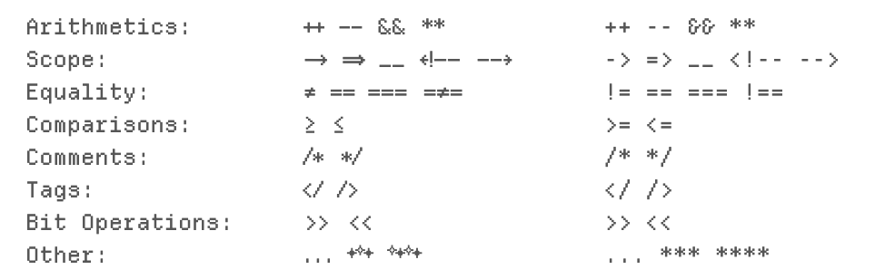

<h1 align="center">
Ligatures
</h1>

## Disclaimer
Please note that these are unofficial, all credits for the original font go to Helena Zheng! If there are any other programming ligatures, feel free to make suggestions and I can try adding them until official ligatures are released. 

## Added Ligatures
Right: With ligatures. Left: Original without ligatures.


## Usage
You can download the .otf file in this folder and install it into your system. So far, I've only tested these on VSCode so I'm not sure how these work on other IDEs.

**FOR VSCODE: MAKE SURE TO ADD THIS INTO YOUR SETTINGS.JSON** 
```
"editor.fontFamily" : "Departure Mono", 
"editor.fontLigatures": "true",
```
or, you could also add extra settings:
```
"editor.fontFamily" : "Departure Mono", 
"editor.fontLigatures": "'ss01', 'ss02', 'onum'",
```
As of now, 'ss01' changes the & symbol to be the same one used in the ligatures and 'ss02' changes the placement of * to be lower. 'onum' creates old-style numbering (I did not change any of these from the original font).

Unfortunately, I'm not sure how to add settings for separate features the way FiraCode does, so these ligatures come all together for now. 